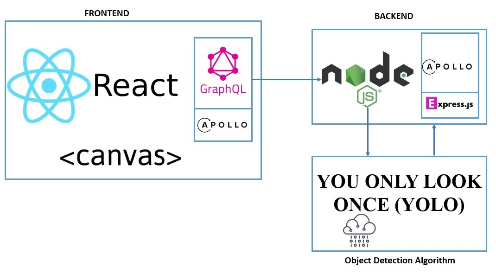

- Ensure that Docker is allocated 7GB memory
- Ensure that yolo2.weights is placed into Yolo folder
- Execute docker-compose up

Frontend -> localhost:3000
Server -> localhost:4000
Yolo -> localhost:5000

[![Contributors][contributors-shield]][contributors-url]
[![Forks][forks-shield]][forks-url]
[![Stargazers][stars-shield]][stars-url]
[![Issues][issues-shield]][issues-url]
[![MIT License][license-shield]][license-url]
[![LinkedIn][linkedin-shield]][linkedin-url]

<!-- PROJECT LOGO -->
<br />
<p align="center">
  <a href="https://github.com/sgtech-ict3104/ict3104-team10-2019">
    
  </a>
  <h2 align="center">ICT3102 PRT - Team 06</h2>
  <h1 align="center">Basic Object Detection</h1>
  </p>
</p>

<!-- TABLE OF CONTENTS -->

## Table of Contents

- [About the Project](#about-the-project)
  - [Built With](#built-with)
- [Getting Started](#getting-started)

  - [Prerequisites](#prerequisites)
  - [Installation](#installation)

- [System Architecture](#systemarchitecture)
  - [Frontend](#frontend)
  - [YOLO](#YOLO)
  - [Backend](#backend)
- [Usage](#usage)
- [Roadmap](#roadmap)
- [Contributing](#contributing)
- [License](#license)
- [Contact](#contact)
- [Acknowledgements](#acknowledgements)

# Introduction

[![Product Name Screen Shot][product-screenshot]](https://example.com)

Project Object Detection is part of a collaborative project between SIT and an industry partner with the main objective of creating a simple Single Page Application (SPA) with the corresponding backend services to detect and identify objects in the selected image.
<br>
<br>
There are two versions of the project with this being the basic project with extremely simplistic set up procedures and the other intermediate project that requires a little more advanced set up explained at [ICT3102_PRT_Object Detection Advanced](https://github.com/sithongfatt/ICT3102_PRT/tree/masterlb)


## System Architecture

The following system architecture diagram will give a high level view of how the three main components of the application will interact with one another.

<p align="center">
  <a href="https://github.com/sgtech-ict3104/ict3104-team10-2019">
    
  </a>
  <h3 align="center">ICT 3102-Team 06-2019:Performance Requirement & Testing</h3>
  <p align="center">
  </p>
</p>
The three main components are broken down: 
<br>

- Client facing Frontend running on ReactJS with GraphQL Apollo Client
- Transaction optimising Backend Server running on NodeJS's Express with GraphQL Apollo Server
- Image's object detection processing YOLO Server running on Python's Flask

A high level view of the application's single transaction is as follow:

---> Client submits an image on the Frontend with stated minimum confidence level
<br>
---> Backend Server receives the image and optimises the request over to YOLO
<br>
---> YOLO processes the image and returns a JSON response of the objects detected
<br>
---> Backend Server receives the JSON response and optimises the response over to Frontend
<br>
---> Frontend receives the JSON response and draws on the image to identify the objects

## System Design

### Frontend

### YOLO

### Flask API

`Flask` is used to provide services for the backend `nodeJS` to call and transmit a byte array through `JSON`.

Once `nodeJS` calls the post method and sends over the `JSON`, the result will be sent to `Flask`, followed by the object detection method.
Afterwards, the result will be returned back to Flask and directly to nodeJS, no storing needed.


<!-- USAGE EXAMPLES -->

## Usage

Usage of `darkflow` in our object detection function.

The byte array passed over from `Flask` will be directly used instead of having the need to `opencv` in the case of an URL.
This will speed up the process and reducing the response time.


Output of object detection:

```sh
[{'label': 'person', 'confidence': 0.3876104, 'topleft': {'x': 991, 'y': 337}, 'bottomright': {'x': 1133, 'y': 442}},
{'label': 'truck', 'confidence': 0.16879167, 'topleft': {'x': 221, 'y': 268}, 'bottomright': {'x': 1711, 'y': 732}},
{'label': 'car', 'confidence': 0.80724114, 'topleft': {'x': 255, 'y': 281}, 'bottomright': {'x': 1688, 'y': 755}}]
```

- label: type of object
- confidence: somewhere between 0 and 1 (how confident yolo is about that detection)
- topleft: pixel coordinate of top left corner of box.
- bottomright: pixel coordinate of bottom right corner of box.

# Getting Started

`Please ensure not to run the two version concurrently, remove the version fully before setting up the other.`

## Prerequisites

- Windows 10 Home Edition
- 8 GB Memory
- [Docker Toolbox](https://github.com/docker/toolbox/releases)
- [Oracle VM VirtualBox](https://www.virtualbox.org/wiki/Downloads)

## Docker Environment Installation

1. Download `Docker Toolbox` from https://github.com/docker/toolbox/releases

2. Go through the installation client of `Docker Toolbox` while checking the following to download
<p align="center">
  
</p>

3. After installation, run `Docker Quickstart Terminal` and accept the port permission prompts
<br>
Docker is ready once the following is loaded with a Guest IP of `192.168.99.100` (May differ)

<p align="center">
  
</p>

4. Stop the `Virtual Machine` first to configure settings by executing the following:
```sh
docker-machine stop
```

4. Run `Oracle VM Virtualbox` and right click on the virtual machine named `default` to access the settings

5. Select `System` and ensure that the `Base Memory` is increased to at least 6 GB Memory

6. Select `Network` and click on "Advanced" to expand

7. Click on `Port Forwarding` and click on the add icon at the top right hand side

8. Add in three new rows and enter the folllowing information :

```sh
Name     | Protocol | Host IP   | Host Port | Guest IP       | Guest Port
frontend | TCP      | 127.0.0.1 | 3000      | 192.168.99.100 | 3000
server   | TCP      | 127.0.0.1 | 4000      | 192.168.99.100 | 4000
yolo     | TCP      | 127.0.0.1 | 5000      | 192.168.99.100 | 5000
```

9. Start the `Virtual Machine` again to start using Docker by executing the following :
```sh
docker-machine start
```

## Project Installation

1. Clone the project with the following git link :

```sh
https://github.com/sithongfatt/ICT3102_PRT.git
```

2. Enter the cloned project directory by :

```javascript
// Example of PROJECTDIR = C:\Users\DiligentStudent\GitHub\ICT3102_PRT
cd "PROJECTDIR"
```

3. Execute either one of the following compose command :

```javascript
// Attached
docker-compose up
```

```javascript
// Detached
docker-compose up -d
```

4. Start accessing the Single Page Application by going to [this link](http://localhost:3000)
```sh
http://localhost:3000
```


<!-- ROADMAP -->

# Roadmap

See the [open issues](https://github.com/othneildrew/Best-README-Template/issues) for a list of proposed features (and known issues).

<!-- CONTRIBUTING -->

## Contributing

Contributions are what make the open source community such an amazing place to be learn, inspire, and create. Any contributions you make are **greatly appreciated**.

1. Fork the Project
2. Create your Feature Branch (`git checkout -b feature/AmazingFeature`)
3. Commit your Changes (`git commit -m 'Add some AmazingFeature'`)
4. Push to the Branch (`git push origin feature/AmazingFeature`)
5. Open a Pull Request

## Built With

This section should list any major frameworks that you built your project using. Leave any add-ons/plugins for the acknowledgements section. Here are a few examples.

- [Bootstrap](https://getbootstrap.com)
- [JQuery](https://jquery.com)
- [Laravel](https://laravel.com)

<!-- LICENSE -->

## License

Distributed under the MIT License. See `LICENSE` for more information.

<!-- CONTACT -->

## Contact

Your Name - [@your_twitter](https://twitter.com/your_username) - email@example.com

Project Link: [https://github.com/your_username/repo_name](https://github.com/your_username/repo_name)

<!-- ACKNOWLEDGEMENTS -->

## Acknowledgements

- [GitHub Emoji Cheat Sheet](https://www.webpagefx.com/tools/emoji-cheat-sheet)
- [Img Shields](https://shields.io)
- [Choose an Open Source License](https://choosealicense.com)
- [GitHub Pages](https://pages.github.com)
- [Animate.css](https://daneden.github.io/animate.css)
- [Loaders.css](https://connoratherton.com/loaders)
- [Slick Carousel](https://kenwheeler.github.io/slick)
- [Smooth Scroll](https://github.com/cferdinandi/smooth-scroll)
- [Sticky Kit](http://leafo.net/sticky-kit)
- [JVectorMap](http://jvectormap.com)
- [Font Awesome](https://fontawesome.com)

<!-- MARKDOWN LINKS & IMAGES -->
<!-- https://www.markdownguide.org/basic-syntax/#reference-style-links -->

[contributors-shield]: https://img.shields.io/github/contributors/othneildrew/Best-README-Template.svg?style=flat-square
[contributors-url]: https://github.com/othneildrew/Best-README-Template/graphs/contributors
[forks-shield]: https://img.shields.io/github/forks/othneildrew/Best-README-Template.svg?style=flat-square
[forks-url]: https://github.com/othneildrew/Best-README-Template/network/members
[stars-shield]: https://img.shields.io/github/stars/othneildrew/Best-README-Template.svg?style=flat-square
[stars-url]: https://github.com/othneildrew/Best-README-Template/stargazers
[issues-shield]: https://img.shields.io/github/issues/othneildrew/Best-README-Template.svg?style=flat-square
[issues-url]: https://github.com/othneildrew/Best-README-Template/issues
[license-shield]: https://img.shields.io/github/license/othneildrew/Best-README-Template.svg?style=flat-square
[license-url]: https://github.com/othneildrew/Best-README-Template/blob/master/LICENSE.txt
[linkedin-shield]: https://img.shields.io/badge/-LinkedIn-black.svg?style=flat-square&logo=linkedin&colorB=555
[linkedin-url]: https://linkedin.com/in/othneildrew
[product-screenshot]: images/screenshot.png
