<!-- PROJECT LOGO -->
<br />
<p align="center">
  <a href="https://github.com/sgtech-ict3104/ict3104-team10-2019">
    
  </a>
  <h2 align="center">ICT3102 PRT - Team 06</h2>
  <h1 align="center">Advanced Object Detection</h1>
  </p>
</p>

<!-- TABLE OF CONTENTS -->

## Table of Contents

- [Introduction](#introduction)
  - [System Architecture](#System-Architecture)
  - [System Design](#System-Design)
    - [Three Layer Architecture](#Three-Layer-Architecture)
    - [Asynchronous Client Side Rendering](#Asynchronous-Client-Side-Rendering)
    - [Bytes Array Transmission over Image](#Bytes-Array-Transmission-over-Image)
    - [GraphQL Query and Mutation](#GraphQL-Query-and-Mutation)
    - [User Centric Design](#User-Centric-Design)
    - [Compressed Docker Deployment](#Compressed-Docker-Deployment)
    - [HAProxy Load Balancing](#HAProxy-Load-Balancing)
- [Getting Started](#getting-started)
  - [Prerequisites](#prerequisites)
  - [Docker Environment Installation](#Docker-Environment-Installation)
  - [Project Installation](#Project-Installation)
- [Project Technology Stack](#Project-Technology-Stack)
  - [Frontend](#Frontend)
  - [Backend Server](#Backend-Server)
  - [Yolo Server](#Yolo-Server)
- [Acknowledgements](#Acknowledgements)
- [Contact Team](#Contact-Team)

# Introduction

Project Object Detection is part of a collaborative project between SIT and an industry partner with the main objective of creating a simple Single Page Application (SPA) with the corresponding backend services to detect and identify objects in the selected image.
<br>
<br>
There are two versions of the project with this being the intermediate project that requires a little more advanced set up and the other basic project with extremely simplistic set up procedures explained at [ICT3102_PRT_Object Detection Basic](https://github.com/sithongfatt/ICT3102_PRT/tree/master)


## System Architecture

The following system architecture diagram will give a high level view of how the three main components of the application will interact with one another.

<p align="center">
  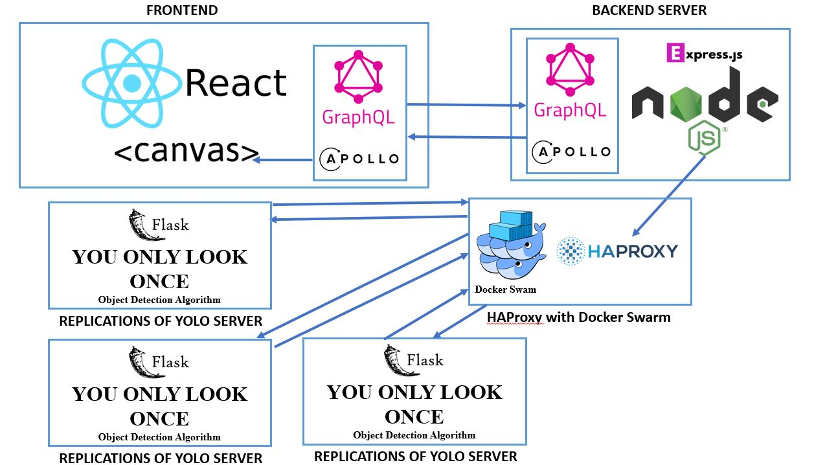
</p>
The four main components are broken down: 
<br>

- Client facing Frontend running on ReactJS with GraphQL Apollo Client
- Transaction optimising Backend Server running on NodeJS's Express with GraphQL Apollo Server
- Load balancing at HAProxy to direct traffic to one of the few replications of YOLO server
- Image's object detection processing YOLO Server running on Python's Flask

A high level view of the application's single transaction is as follow:

---> Client submits an image on the Frontend with stated minimum confidence level
<br>
---> Backend Server receives the image and optimises the request over to HAProxy
<br>
---> HAProxy uses the least connection method to select which YOLO server to send the request to
<br>
---> YOLO processes the image and returns a JSON response of the objects detected
<br>
---> HAProxy receives the JSON response and directs response to Backend Server
<br>
---> Backend Server receives the JSON response and optimises the response over to Frontend
<br>
---> Frontend receives the JSON response and draws on the image to identify the objects

## System Design

Looking at the overview of how the four main components will interact, it is prominent that there will be a huge load of the requests coming from the Frontend. There will be `Multiple Clients` requesting towards a `Single Backend Server` which then passes the request towards a `Single HAProxy` that directs the traffic to the least connected `Multiple Yolo Server`. Therefore, distributing work load across the components was instilled into the design of the architecture. Furthermore, the communications between the dockerized containers are essential to the success of the project and there were a certain degree of optimisation done to ensure quick and smooth deployment.

The following sections will be discussing on the key points in the design of the project :

- Three Layer Architecture
- Asynchronous Client Side Rendering
- Bytes Array Transmission over Image
- GraphQL Query and Mutation
- User Centric Design
- Compressed Docker Deployment
- HAProxy Load Balancing

### Three Layer Architecture

The three main component follows the Single Responsibility Principle that acts as three modularized modules to perform specific tasks. As the Yolo Server has the heaviest workload, the other two components are there to offload it. In addition, this modularized architecture allows scalablity in terms as the processing power can be easily enhanced by adding powerful GPUs or adding more Yolo Servers.
<br>

The `Frontend` is designed to offload the image processing required in the Servers by being the only component that renders the image and performs drawing on it based on the JSON response. 

The `Backend Server` is designed to offload the Yolo Server's workload by reading the image data sent by the Frontend through GraphQL Apollo Client-Server in bytes array format. Afterwhich the bytes array is concatenated and converted into a JSON request perfectly suitable for the request towards the Yolo Server.

The `Yolo Server` will then receive the well prepared and suitable data type request from the Backend Server and is only in charged of processing the objects detection. In addition, the Yolo Server returns a very light weight JSON response of the object labels and coordinates to be rendered on the Frontend.

### Asynchronous Client Side Rendering

As there are no physical image being transmitted, the client side Frontend is fully responsible for the rendering and drawing of the image and objects detected. In order to optimise this work flow, the Frontend immediately displays the submitted image on the left hand side and draws another copy into a canvas on the right hand side after the request has been sent over to the Backend Server as seen below :
<p align="center">
  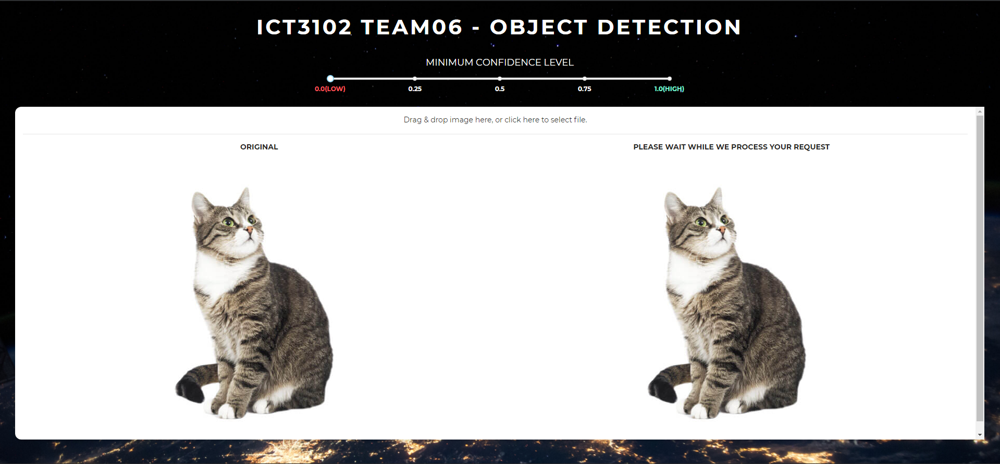
</p>
Upon receiving the asynchronous JSON response from Yolo Server, transmitted by the Backend Server, the client will then continue to draw the object detected on the canvas. This method of rendering ensures that the user is fully aware that things are running smoothly.
<p align="center">
  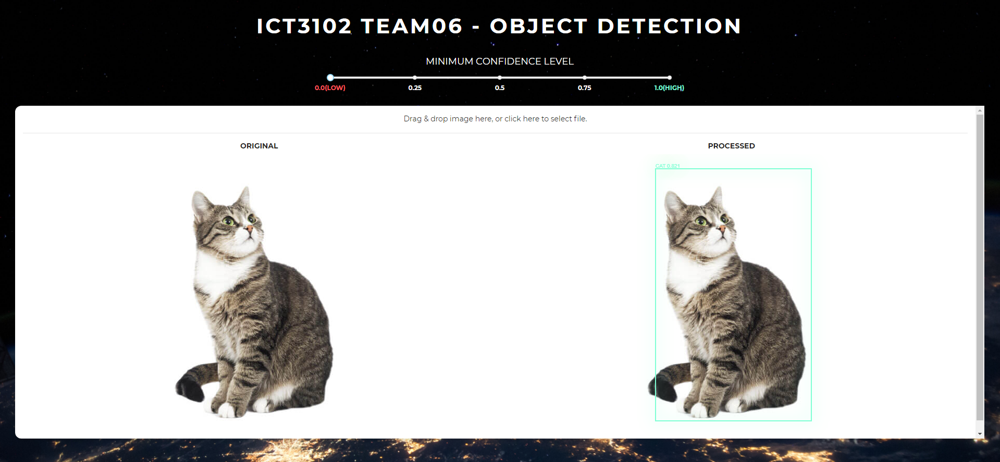
</p>


### Bytes Array Transmission over Image

Even though the team understands that storage space is less costly in the current generation, the team identified that the scope of the project does not require any storing of image at all to perform the necessary functionalities. 
Zero images are stored in the whole process of the project and the image is passed around in the following manner :
<p align="center">
  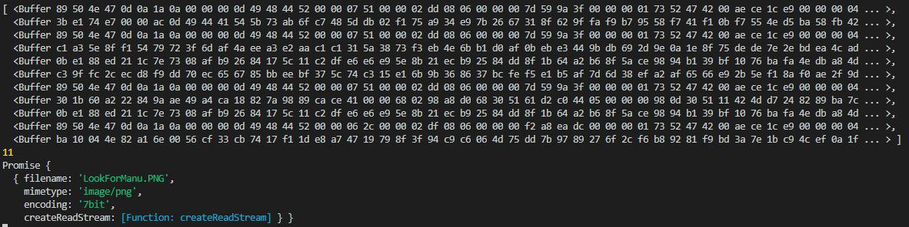
</p>

Therefore, the images are transmitted across components as bytes array, the perfect data type that the Yolo Server can process directly instead of having the need to establish a connection with opencv to read the binaries. This will speed up the process and reducing the response time as the Yolo server now only has to execute the object detection algorithm and return a JSON response. 

<p align="center">
  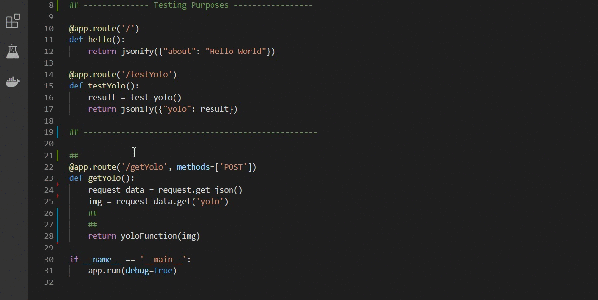
</p>

The lightweight JSON response of the Yolo Server is shown below :

```sh
[{'label': 'person', 'confidence': 0.3876104, 'topleft': {'x': 991, 'y': 337}, 'bottomright': {'x': 1133, 'y': 442}},
{'label': 'truck', 'confidence': 0.16879167, 'topleft': {'x': 221, 'y': 268}, 'bottomright': {'x': 1711, 'y': 732}},
{'label': 'car', 'confidence': 0.80724114, 'topleft': {'x': 255, 'y': 281}, 'bottomright': {'x': 1688, 'y': 755}}]
```

- label: Identified type of object
- confidence: A float between 0.0 and 1.0 aboue the confidence yolo has about the detection
- topleft: Pixel coordinate of top left corner of box.
- bottomright: Pixel coordinate of bottom right corner of box.

### GraphQL Query and Mutation

Instead of the conventional REST calls, the project utilises GraphQL to empower the Frontend with the ability to only query the necessary information. In view that the Yolo algorithm may scale and evolve to large returned dataset in future, GraphQL allows the Frontend to easily scale alongside by only requesting what is required. Furthermore, when the system becomes more complex and introduces more microservices, GraphQL is a good fit as it can merge communications between multiple microservices into one GraphQL Schema.

<p align="center">
  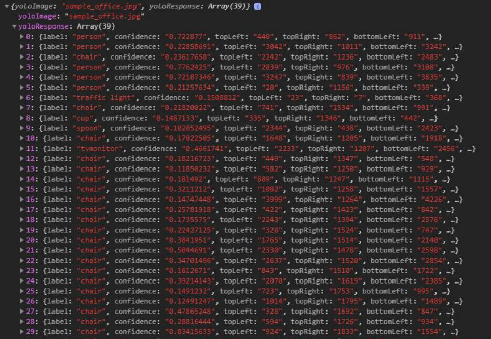
</p>

### User Centric Design

As mentioned in the design thinking behind GraphQL, the project is very user centric and the team further thought of how the users will behave while interacting with the system. It has been identified that users uses the system to detect objects accurately and would in most of the case look for results of the highest confidence level. Therefore, the project also included a slider for the user to easily let the Backend Server know what is the minimum confidence level that the user wants. At the same time, this feature assist in reducing the workload of the Frontend as there are no redundant results of low confidence level sent back to the client for rendering.

<h3 align="center"><b>0.0</b> Minimum Confidence Level fetches all results</h3> 

<p align="center">
  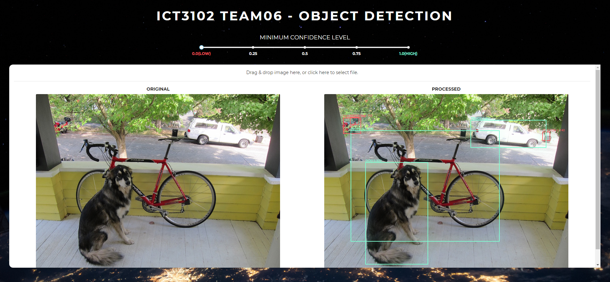
</p>

<h3 align="center"><b>7.5</b> Minimum Confidence Level fetches only accurate results</h3> 

<p align="center">
  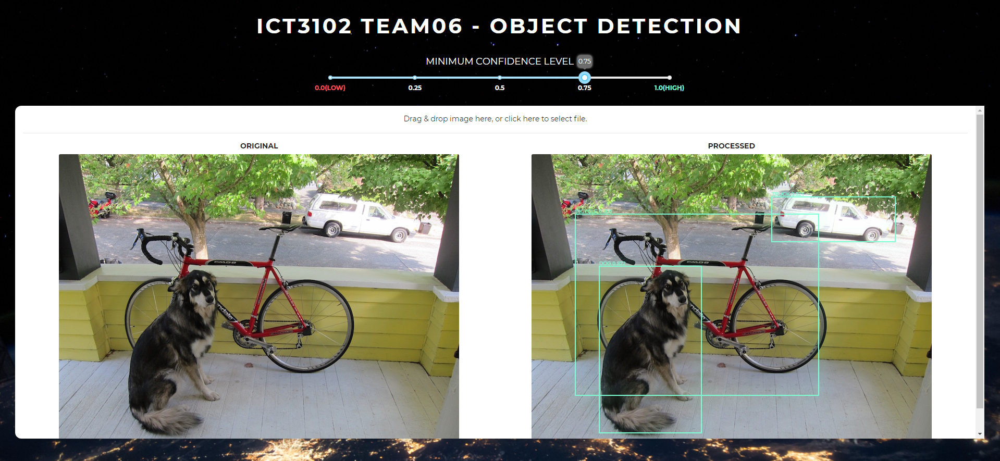
</p>

### Compressed Docker Deployment

The project heavily utilised depcheck library to ensure that the dependencies in `package.json` is exactly what the system requires and that there are redundancy. Following the result set of depcheck, the package.json will only fetch what is required :

<p align="center">
  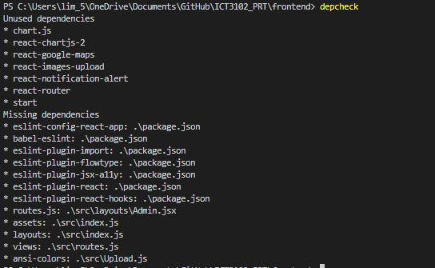
</p>

<h3 align="center">As a result of doing so, the Docker image is significantly reduced from</h3> 

<p align="center">
  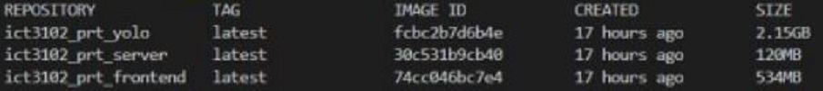
</p>

<h3 align="center">to</h3>

<p align="center">
  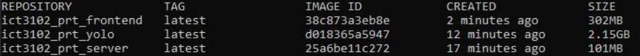
</p>

### HAProxy Load Balancing
As the team has identified in the Basic Object Detection project that the `Single Yolo Server` is the endpoint with the heaviest workload, the team decided to further scale the project in Advanced Object Detection to load balance the request over to multiple replications of the Yolo Server using Docker Swarm Service :

<p align="center">
  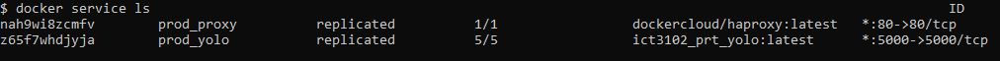
</p>

In addition, these replicated services will be an individual container by itself :

<p align="center">
  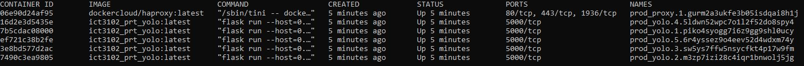
</p>

In order to scale the service to more than 5 containers, simply execute the command in Docker to start 45 more containers :

```sh
docker service scale prod_yolo=50
```

Check if response is being redirected to the least connection by calling and checking response of different container hostnames :

<p align="center">
  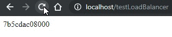
</p>


# Getting Started

`Please ensure not to run the two version concurrently, remove the version fully before setting up the other.`

`Time for Docker Compose will take an average of 10 minutes from a clean Docker.`

## Prerequisites

- Windows 10 Home Edition
- 8 GB Memory
- [Docker Toolbox](https://github.com/docker/toolbox/releases)
- [Oracle VM VirtualBox](https://www.virtualbox.org/wiki/Downloads)

## Docker Environment Installation

1. Download `Docker Toolbox` from https://github.com/docker/toolbox/releases

2. Go through the installation client of `Docker Toolbox` while checking the following to download

<p align="center">
  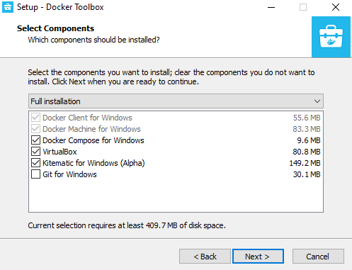
</p>

3. After installation, run `Docker Quickstart Terminal` and accept the port permission prompts
<br>
Docker is ready once the following is loaded with a Guest IP of `192.168.99.100` (May differ)

<p align="center">
  
</p>

4. Stop the `Virtual Machine` first to configure settings by executing the following:
```sh
docker-machine stop
```

4. Run `Oracle VM Virtualbox` and right click on the virtual machine named `default` to access the settings

5. Select `System` and ensure that the `Base Memory` is increased to at least 6 GB Memory

6. Select `Network` and click on "Advanced" to expand

7. Click on `Port Forwarding` and click on the add icon at the top right hand side

8. Add in three new rows and enter the folllowing information :

```sh
Name     | Protocol | Host IP   | Host Port | Guest IP       | Guest Port
frontend | TCP      | 127.0.0.1 | 3000      | 192.168.99.100 | 3000
server   | TCP      | 127.0.0.1 | 4000      | 192.168.99.100 | 4000
yolo     | TCP      | 127.0.0.1 | 5000      | 192.168.99.100 | 5000
```

9. Start the `Virtual Machine` again to start using Docker by executing the following :
```sh
docker-machine start
```

## Project Installation

1. Clone the project with the following `git` link :

```sh
https://github.com/sithongfatt/ICT3102_PRT.git
```

2. Switch the git branch over to `masterlb` for Advanced Object Detection :

2. Download `yolov2.weights` from [this link](https://pjreddie.com/media/files/yolov2.weights)
```sh
https://pjreddie.com/media/files/yolov2.weights
```

3. Move the `yolov2.weights` into the yolo folder directory located at :
```sh
Example of YOLODIR = C:\Users\DiligentStudent\GitHub\ICT3102_PRT\Yolo
```

4. Docker enter the cloned yolo folder directory by executing the following `cd` command :

```javascript
// Example of YOLODIR = C:\Users\DiligentStudent\GitHub\ICT3102_PRT\Yolo
cd "YOLODIR"
```

5. First build the yolo image with the command :

```sh
docker build -t ict3102_prt_yolo .
```

6. Initiate the docker swarm by executing either of the command depending on the OS :

```javascript
// Windows Pro Edition / Linux / Mac
docker swarm init

// Windows Home Edition
docker swarm init --advertise-addr 192.168.99.100
```

7. Deploy your yolo servers by executing :

```sh
docker stack deploy --compose-file=docker-compose.yml prod
```

8. In the case where the containers of the HAProxy and yolo servers are not yet running :

```javascript
// Check if container is running by
docker ps

// If containers are not running
docker service update --image ict3102_prt_yolo prod_yolo
```

9. Return to root directory to start Backend Server and Frontend :

```sh
cd ..
```

10. Execute either one of the following compose command :

```javascript
// Attached
docker-compose up
```

```javascript
// Detached
docker-compose up -d
```

11. Start accessing the Single Page Application by going to [this link](http://localhost:3000)
```sh
http://localhost:3000
```

# Project Technology Stack


## Frontend

- [ReactJS](https://expressjs.com/)
- [Material-UI](https://material-ui.com/)
- [CreativeTim](https://www.creative-tim.com/product/paper-dashboard-react)
- [GraphQL Apollo Client](https://github.com/apollographql/apollo-client)

## Backend Server

- [NodeJS](https://nodejs.org/en/)
- [Express](https://expressjs.com/)
- [CreativeTim](https://www.creative-tim.com/product/paper-dashboard-react)
- [GraphQL Apollo Server](https://github.com/apollographql/apollo-server)

## Yolo Server

- [Python Buster](https://packages.debian.org/buster/python3)
- [Flask](https://www.fullstackpython.com/flask.html)
- [TensorFlow](https://www.tensorflow.org/)
- [Darknet](https://pjreddie.com/darknet/)

# Acknowledgements

- [apollo-upload-client](https://github.com/jaydenseric/apollo-upload-client)
- [rc-slider](https://www.npmjs.com/package/rc-slider)
- [react-dropzone](https://github.com/react-dropzone/react-dropzone)
- [depcheck](https://www.npmjs.com/package/depcheck)


# Contact Team

## LinkedIn Profiles

 - `Darren Lim @ ` https://www.linkedin.com/in/darren-lim-chuan-siang-91213012b/
 - `Darren Xiao @ ` https://www.linkedin.com/in/darren-jin-ru-xiao-745911a6
 - `Evelyn @ ` https://www.linkedin.com/in/evelyn-tan-6ab41b174/
 - `Hong Fatt @ ` https://www.linkedin.com/in/siew-hong-fatt-094955120/
 - `Jasper @ ` https://www.linkedin.com/in/jasper-chua-346532152/
 - `Siti @ ` http://linkedin.com/in/siti-nadhirah-aziz-2b513913a
